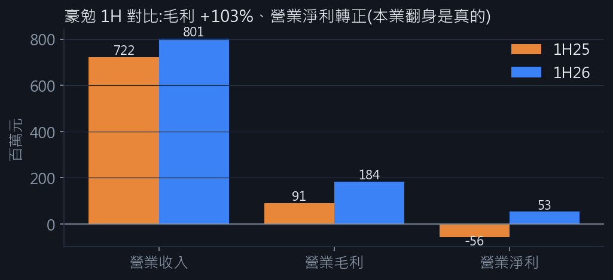
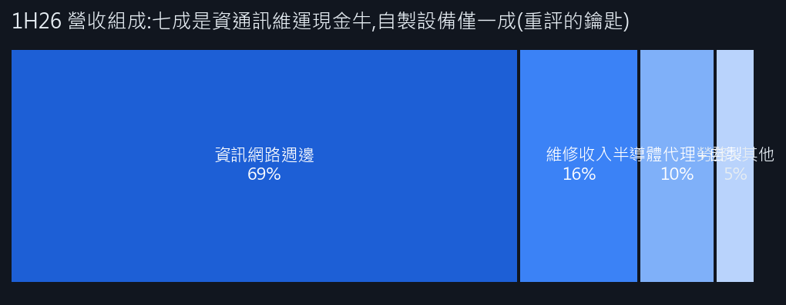

<!--meta
title: 觀察筆記|豪勉(6218)前世今生:47 年老代理商的轉盈,與一段被題材放大的行情
code: 6218
name: 豪勉
mode: 深度潛力股
date: 2026-09-27 00:40
-->

# 觀察筆記|豪勉(6218)前世今生:47 年老代理商的轉盈,與一段被題材放大的行情

> 資料:**公司 2026/08/21 Q2 法說會簡報(MOPS,全文已讀)**、公司公告/財報、nStock、鉅亨/CMoney 報導、本系統 9/24 快分析。個人研究筆記,非投資建議。**先說結論:這是四篇裡故事最薄的一檔,本文的價值在於把「薄」講清楚——但法說修正了一個重要事實:它有自製設備,只是還小。**

## 〇、一段話講完這個故事

豪勉 1979 年成立、2003 年上櫃,股本 6.43 億、員工 200 人,兩條腿:**資通訊系統整合維運**(7×24 維運,客戶=企業 54%/電信 19%/政府 12%/金融 7%,佔營收約七成)+**半導體/LED 設備(代理與自製)**。2025 年上半年還虧(1H25 EPS -0.42),2026 年翻身:**1H26 營收 8.0 億(+11%)、毛利 1.84 億(+103%)、營業淨利由 -5,633 萬轉正到 +5,292 萬、EPS 2.41**(法說簡報頁 12 原文數字)。8 月營收 1.41 億再創十年同期新高。股價一個月 +59%。

**拆帳(精確版)**:股本 6,426 萬股,營業淨利 5,292 萬 → 本業貢獻 EPS 約 **0.82 元**,其餘約 **1.59 元是業外**——本業轉正是真的,但佔 EPS 只有三分之一。**它和蔚華科(3055)是同一物種的兩個樣本:都是代理起家謀自製,差別在規模與卡位——蔚華的自研已是營收引擎與專利牆,豪勉的自製線還只佔一成。**

## 一、前世:47 年的代理生意

民國 68 年(1979)成立,走過台灣電子業整個代工年代,2003 年上櫃。法說簡報(8/21)給出的營收結構(1H26):
- **資訊網路週邊 5.56 億(69%)**+維修收入 1.25 億(16%):7×24 資通訊整合維運,ISO 9001/27001/14064 認證,客戶以企業(54%)/電信(19%)/政府(12%)/金融(7%)為主——**這是現金牛,也是「資安題材」唯一沾得上邊的地方(27001+電信政府客戶),但它賣的是維運服務,不是資安產品**
- **半導體代理及自製 0.78 億(10%)**:這條線被市場低估了細節——自製設備一張表(法說頁 8-10):

| 自製機台 | 打什麼 | 客戶端 | 亮點 |
|---|---|---|---|
| HP1000-V5P 系列 | LED 光電測試(正裝/倒裝/**VCSEL**) | LED/光電廠 | **2013 年起累計裝機 2,600+ 台** |
| HVP1000/HFP1000 | **Mini LED / Flip-Chip** 測試 | 新型顯示鏈 | 高階版本 PIV/近遠場量測 |
| 外觀檢測機 | IC 晶片與特殊封裝模組 AOI | **IC 封測廠/CIS 封測廠** | 吃封測 capex 回升 |
| Novtek 200°C | 記憶體高溫耐讀寫測試 | 記憶體廠 | FLASH 現貨+**R-RAM/M-RAM 開發中** |

**營收組成與客戶結構(法說頁 6、13):**

客戶結構:企業 54%/電信 19%/政府 12%/金融 7%/教育 4%/醫療 4%——維運現金牛的客群黏性所在。

代理+服務模式的天花板寫在歷史數字上:毛利率 3%~27% 劇烈擺盪、月營收顛簸(4 月 +99%、5 月 -39%)、2025 全年營益率全負。**先前版本說它「從未擁有自己的產品」是錯的——它有,而且 LED 測試機是隱形冠軍級的裝機量;真正的問題是這條自製線只佔營收一成,還撐不起重評價。**這是與蔚華科命運分岔的量級差,不是有無之差。

## 二、今生:轉盈是真的,但要拆開看

| 季度 | 營收(億) | 毛利率 | 營益率 | 淨利率 | EPS |
|---|---|---|---|---|---|
| 2025Q4 | 3.50 | 3.16% | -15.96% | -8.49% | -0.46 |
| 2026Q1 | 4.18 | 19.59% | **5.30%** | 5.31% | 0.35 |
| 2026Q2 | 3.83 | 26.65% | **8.04%** | **34.65%** | **2.07** |

**真的部分**:營益率連兩季轉正、毛利率回到 20%+、8 月營收 1.41 億創十年同期新高(+52.9% YoY、月增 37%)——半導體設備/材料代理的景氣回升是實在的,搭上客戶擴產週期。
**要打折的部分**:Q2 淨利率 34.65% 遠高於營益率 8.04%,**業外(推測為投資處分/金融資產評價類)貢獻了 EPS 2.07 中的約 1.6 元**。用「年化 EPS 8 元、PE 8 倍好便宜」的算法是把一次性當常態——本業年化約 1.5~1.8 元,現價 63.6 對應**本業 PE 35~42 倍**。
**題材的部分**:9 月的漲停潮,媒體歸因是「資安題材+中小型網通輪動」——輪動資金選中它,因為股本小(6.43 億)、有轉盈題材、位階低。**題材是放大器,不是基本面。**

## 三、需求與展望(以代理商的框架看)

1. **上行情境**:客戶端半導體擴產持續 → 設備/材料代理接單續強;若 9-12 月營收維持 1.3 億+/月(YoY 40%+),本業年化 EPS 有機會上修到 2 元+,屆時 30 倍本業 PE 開始說得通
2. **中性情境**:代理生意的常態=跟著客戶 capex 波動;單月創高後回落到 1 億上下,本業 EPS 1.5 元級,現價已充分定價
3. **下行情境**:業外不再貢獻+題材輪動退潮 → 回到「本業小賺的小型代理股」評價,量縮陰跌
4. **翻身的真正條件**(向蔚華科對照):重評價路徑=**自製設備線(現佔 10%)能不能長大**。追蹤兩個具體點:外觀檢測機在 IC/CIS 封測廠的滲透(封測 capex 回升是順風)、記憶體測試機吃到 R-RAM/M-RAM 新品驗證需求與記憶體漲價週期。自製佔比若走向 2~3 成,故事就從「景氣股」升級「設備股」——這是它與 3055 估值差距收斂的唯一路徑

## 四、籌碼與位置(截至 9/26)

- 現價 63.6,20 日 **+59.2%**,距年高 -6.1%;9/22 天量長黑(1.26 萬張,4.7 倍中位量)後在 60-64 整理——天量統計的洗盤劇本進行中(中位洗 -11% ≈ 60.2,已觸及)
- 體檢卡 **🟡1紅1黃**:爆量追高窗+融資擁擠;**大戶 4 週轉為加碼 🟢**(這是比 9/24 改善的一格)、外資小買、隔日沖無樣本
- **家規裁決**:爆量窗未過,不新進場。若整理完站回 62-64 且量縮,想參與者以**半倉再對折(日振幅 6.7%)= 1/4 倉**為上限,停損掛進場價 -1.5ATR(約 -6.4 元);**進場理由必須寫「賭代理景氣週期」,不准寫「資安概念」——寫得出口的理由才是理由**

## 五、結語——別把景氣週期當轉型

豪勉的 47 年證明它是一家會活的公司;2026 的轉盈(本業 1H +5,292 萬,是真的)證明維運+代理生意的 beta 回來了,自製設備線也有真底子(LED 測試機裝機 2,600 台)。但**自製僅佔一成、尚無蔚華科那種「新製程卡位+專利牆」的爆發結構**,1H EPS 2.41 有三分之二要還給業外。操作上這是一檔「景氣+題材」股,不是「轉型」股——用週期股的紀律對待它:賺輪動的錢就設好移動停利,別用轉型股的耐心抱它。每月 10 號的營收是唯一需要盯的真數字:**連三個月 1.3 億+,故事升級;跌回 1 億下,故事結束。**

> 免責:以上為個人基於公開資訊之整理與主觀推論,不構成投資建議。
