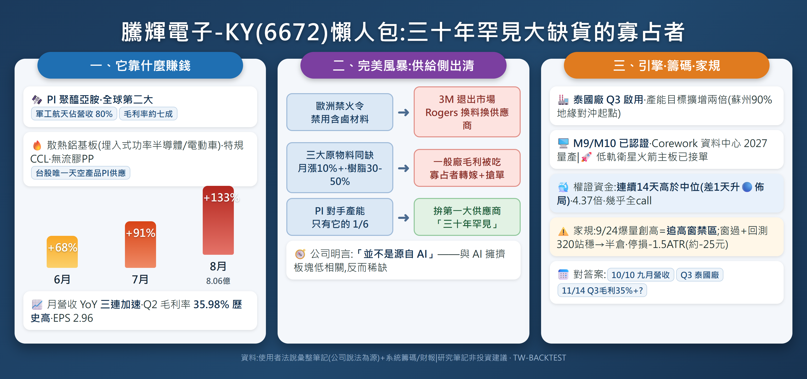

<!--meta
title: 發掘潛力股|三十年罕見的大缺貨——騰輝電子-KY(6672):特規CCL寡占者的完美風暴
code: 6672
name: 騰輝電子-KY
mode: 深度潛力股
date: 2026-09-30 11:00
-->

# 發掘潛力股|三十年罕見的大缺貨——騰輝電子-KY(6672):特規 CCL 寡占者的完美風暴

> 資料:**使用者提供之法說彙整筆記(多方資料佐證,已驗證優先)**+系統價量/籌碼/財報數據。個人研究筆記,非投資建議。

## 〇、一段話講完這個故事

騰輝不是一般 CCL 廠——它自己在股價還在 100 元時就講過:「**特規 CCL 廠,材料應用非常多元**」。核心是**聚醯亞胺(PI):全球第二大供應商,軍工航天應用佔營收約 80%,毛利率約七成**。2026 年的完美風暴:歐洲禁火令禁用含鹵材料 → **3M 退出市場、Rogers 宣布換料換供應商** → 三大主要原物料同時缺貨(公司說法:「三十多年產業經驗中罕見,前輩說四十多年未遇過」)——需求砸向倖存的寡占者。財報全面印證:**月營收 YoY 一路 68%→91%→133% 加速**,Q2 毛利率 35.98% 歷史高點、營益率 16.78% 近三四年高、單季 EPS 2.96。這不是 AI 題材股,是**供給側出清+軍工航天需求**的教科書。

## 一、前世今生:從「大家以為的 CCL 廠」到特規寡占者

KY 公司,產能主力在蘇州(中國產能 90%、台灣泰國 10%)。市場長期把它當一般銅箔基板廠估值,但它的四條產品線全是特規:

| 產品線 | 是什麼 | 應用 | 毛利屬性 |
|---|---|---|---|
| **PI 聚醯亞胺基板** | 全球**第二大**供應商 | **軍工航天主板 80% 營收**、LEO 火箭發射/發動機主板、半導體測試板 | **毛利率約七成** |
| 散熱鋁基板 | 功率散熱 | **大功率散熱半導體(埋入式),供應電動車** | 高 |
| 銅箔基板 | 特規 CCL(2025 市占約 2%) | 光通訊單板(量不大但正貢獻) | 中 |
| 無流膠 PP | 特殊黏合材料 | 搭配特規板材 | 高 |

客戶涵蓋從歹戲拖棚的名單看廣度:蘋果到國巨,被動元件材料都有它的影子——**被動元件材料量產後可再增 5-10% 營收**。另取得多家國際半導體廠**老化測試板應用訂單**、光通訊模組 M7 材料獲多項認證。

## 二、完美風暴:供給側出清的機制(這段是故事的錨)

1. **禁令開槍**:歐洲禁火令禁用含鹵元素材料 → **3M 已退出市場、Rogers 宣布更換材料和供應商**——這不是景氣循環,是**競爭者被法規抬出場**
2. **原料共振**:三大主要原物料同時缺貨,**漲幅每月超過 10%,樹脂等溶劑一次漲幅達 30-50%**(佔成本約三分之一)——一般廠毛利被吃,特規寡占者**轉嫁+搶單**兩頭賺
3. **對手產能只有它的 1/6**(PI):公司自估「很快就可以成為第一大供應商」
4. **結果寫在月營收上**:6 月 +68% → 7 月 +91% → **8 月 +133%(8.06 億)**——加速度,不是回溫

**關鍵區別**:「並不是源自 AI 帶來」——公司自己說的。這檔的成長引擎是軍工航天+供給出清,和 AI 板塊的估值波動**低相關**,在現在這個 AI 擁擠的市場裡反而是稀缺屬性。

## 三、財務驗證(系統數據,六季軌跡)

| 季度 | 營收(億) | 毛利率 | 營益率 | 淨利率 | EPS |
|---|---|---|---|---|---|
| 2025Q2 | 11.03 | 30.09% | 7.70% | 8.02% | 1.24 |
| 2025Q4 | 11.07 | 32.11% | 10.77% | 8.93% | 1.39 |
| 2026Q1 | 12.46 | 34.02% | 11.67% | 9.92% | 1.73 |
| **2026Q2** | **16.14** | **35.98%(歷史高)** | **16.78%** | **14.49%** | **2.96** |

四率齊升+營收季增 30%——**這是量價齊揚寫進損益表的樣子**。H1 EPS 4.69;若 H2 照 7-8 月動能走,全年 EPS 挑戰 11-13 元,現價 335.5 對應前瞻 PE 約 26-30 倍——**貴,但是用「歷史高毛利+加速營收」在定價,不是用夢**。

## 四、未來引擎與時間表

1. **泰國廠**:規劃月產能約十萬張(佔總產能 10%),**第二期投資今年 Q3 啟用,目標產能擴增兩倍**——也是「中國產能 90%」地緣風險的對沖起點
2. **新世代資料中心 M9/Corework**:M9、M10 材料已通過多家廠商認證,量產預計 **2027 年**——明年的成長動能,公司點名「未來成長動能-AI M9!」
3. **低軌衛星**:已獲重要公司訂單,含**火箭發射與火箭發動機主板**——利潤率非常高的延伸
4. 光通訊 M7 材料多項認證,近半年成長動能明顯

## 五、籌碼與家規(截至 9/29)

- 現價 335.5,距年高 -0.6%;9/24 爆量 1.5 萬張創高後高檔橫盤
- **權證資金流:連續 14 天高於中位、近 20 日 4.37 倍——差 1 天就升級 🔵佈局榜**,CP 比 3,287 幾乎全 call;這是「有人天天在買」的形狀
- 體檢卡:🟡 1紅2黃——**爆量追高窗(9/24)+隔日沖/融資黃燈**;外資/投信/大戶三綠
- **家規裁決**:爆量日+2~3 天不進場 → 10/1 之後才議;屆時若權證升 🔵+回測 320 帶站穩,半倉(振幅 5.3% 打折後 1/4~1/2 倉),停損 -1.5ATR(約 -25 元)。**別因為故事完美就跳過家規——故事完美的時候通常也是籌碼最擠的時候**

## 六、風險(空方講完才算報告)

1. **蘇州產能 90%**:地緣集中度是這檔最大的結構風險;泰國廠是解方但今年才 10%
2. **原料漲價雙面刃**:轉嫁能力若見頂,月漲 10% 的成本反噬毛利
3. **軍工客戶透明度低**:訂單能見度靠法說口頭,無法逐季核對
4. **共識真空**:FactSet 無分析師覆蓋——沒有共識可錨,漲跌都會比想像劇烈
5. 使用者筆記為法說彙整,個別數字(對手產能 1/6、原料漲幅)以公司說法為源,無第三方複核

## 七、結語——供給側的稀缺故事

市場在 AI 裡內捲的時候,騰輝在一條**沒有 AI 的成長曲線**上:法規把對手抬出場、原料共振逼出定價權、軍工航天的高毛利需求接棒,泰國產能與 M9 排在 2027 前面。已證明的:四率齊升+營收三連加速+權證資金 14 天連買。未證明的:轉嫁的持續性、泰國廠如期、軍工訂單能見度。對答案:**10/10 九月營收(133% 之後還加速嗎)、Q3 泰國廠啟用確認、11/14 Q3 財報(毛利站穩 35%+?)**。

> 免責:以上為個人基於使用者提供法說彙整與系統公開數據之整理與主觀推論,不構成投資建議。

---

## 補遺(2026-10-06)——重讀法說:被軍工蓋住的四條 AI 線

原報告結語寫「騰輝在一條**沒有 AI 的成長曲線**上」——重讀 8/7 法說頁 5 後,此句**撤回**。公司列了七條成長線,本報告只重押了兩條(國防航太、火箭/衛星),有四條是 AI,全部被軍工敘事蓋住:

1. **AI 資料中心 M9/CoWoP 低損耗材料,認證加速進行中**——這是漏掉的頭條。M9 是 CCL 最高量產等級(Df 0.0007),CoWoP(晶片直接上板的無載板封裝路線)若在 Rubin 世代成真,單板材料含量暴增。騰輝「高速對標松下、高頻對標 Rogers」的產品定位,正排進台光電/生益那一桌
2. **PI 老化測試板(burn-in):數家國際半導體設備大廠全面使用**——AI 晶片越多、burn-in 越多,這是測試耗材循環,吃量不吃景氣
3. **散熱膜/金屬基板:大功率功率半導體與 AI 電源全面展開**——接的是 HVDC/PSU 電源鏈(與瀚荃同一條需求曲線,它賣材料)
4. **光模組與網卡材料:原供應商交期超長,認證機會爆發**——光通訊材料轉單故事

另一個被漏掉的連結:產品清單裡白紙黑字有「散熱、埋入式、超高頻等**無布膠膜材料**」——郭明錤 HC 事件(NVIDIA 測 HC 無布 CCL+無布 PP)的技術路線,騰輝本來就有佈局,**潛在受惠者名單該有它**(假設:是否送樣待查)。

財務上也對得上:特殊材料佔比 2Q26 已達 45.5%(毛利 30-70% 那一桶)、毛利率 35.98%、營益率 16.78%、EPS 2.96(+139%)、ROE 17%、長債 9.75 億還到 1.34 億。**修正後的定位:軍工是「現在的獲利關鍵」(公司原話),AI 四線是「下一棒的選擇權」——這檔不是沒有 AI,是 AI 還沒進財報。**

檢核點新增:M9/CoWoP 認證完成的公告或下次法說進度、burn-in 板放量跡象、無布膠膜是否與 HC 路線沾邊(待查證)。
